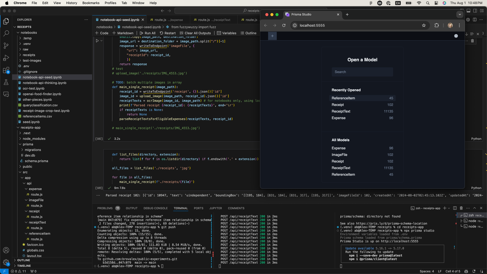
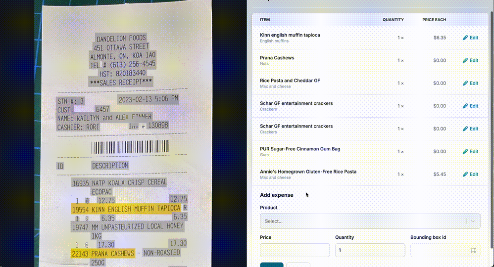

# Receipts scripts and UI app

### Context

To receive Celiac tax credits in Canada, I have to keep all my food receipts, enter eligible gluten-free product, and submit the difference between the price of the gluten-free product and a comparable non-gluten-free product. This takes an inordinate amount of amount of time, so I have created:

- Python scripts (Jupyter notebooks) to convert, crop, read (OCR) receipt photos, and push the expenses to a database
- A basic crud API to interact between the database, the UI app, and the Python scripts
- A basic UI that allows me to select strings of text and associate them with the respective product.

### Scope of work

This is not at all intended as a complete app, it's really just tooling that does the bare minimum to make entering receipts easier for me. 

#### Notebooks file to seed database

#### UI for entering receipts / products

### Folder structure

- Scripts are in `/notebooks`
- UI and backend/API are in `receipts-app`

### Setup / demo

Note that I'm not including my data or receipts in the repo. To get started you will need to: 
- `cd` into the `receipts-app` folder for the Next.js app
- `npm install` and `npm install @prisma@client` and so on to install what you need
- `npx prisma generate` and `npx migrate dev` to create your database file, you'll need an `.env` file (see sample)
- `npx prisma studio` to run studio (if needed)
- `npm run dev` to run the Next.js app
- open `/notebook-api-seed.ipynb` notebook and run the seed script on some receipts. I've included a sample in the test folder.

### Stack

- Scripting: mainly easyocr, fuzzywuzzy, pandas
- UI and backend: Next.js, Flowbite-React, Tailwind (sorry it was the fastest for me)
- ORM: Prisma (sorry it was the fastest for me)
- Database: SQLite (mostly so that I don't have to run an additional process)

### Next steps / todos

- Stop procrastinating and start entering receipts
- Get feedback on code, do some refactoring and clean-up
- Missing `Edit` action on rows (right now I just use studio for edits and deletes)
- Add linting
- Future: might consider add auth / multitenancy, and make it usable as a public app; there would be a lot of UX considerations
